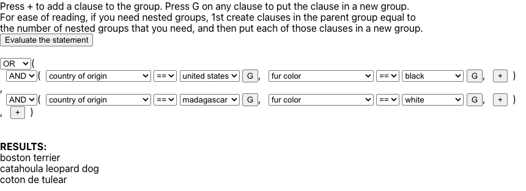
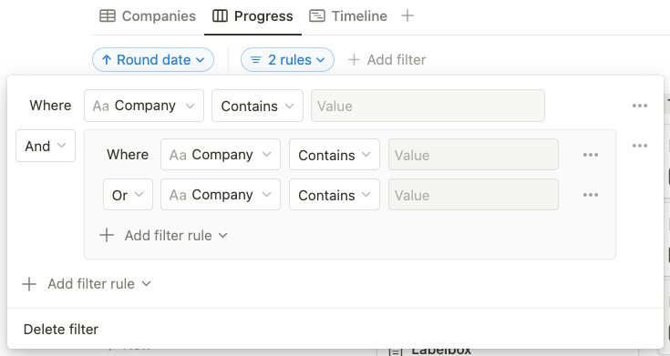

# Dog Finder

This project was bootstrapped with [Create React App](https://github.com/facebook/create-react-app).

## Intro

Fun take-home challenge to create a logical search system to allow a user to "search" for certain dog breeds based on some attributes.

Solution was inspired by Notion's table view Filters:
 

## Running the project

Clone locally and run `npm start` or visit https://davishuang9.github.io/dog-finder/ to see it hosted on GitHub Pages

## Design

Couple goals:
- Basic `AND` and `OR` functionality
- Ability to add multiple clauses and nested groups
- Wanted UX to be intuitive to use / read for 2-3 nested groups
- Wanted UX to be responsive

Couple constraints / limitations:
- Wanted to keep the UI components to simple HTML and not bloat the project with external libraries to save time and to use this opportunity to practice building components from scratch :)
- Intentionally ignored data issues (i.e. duplicate entries, badly formatted attributes, etc.) to focus more on functionality and to also save time

<strong>Overall, the intention was to build an extensible framework with basic functionality (e.g. `AND`, `OR`, `==`, `!=`) that could then easily be extended to handle more complex comparisons, data types, text search etc.</strong>

## Code design

- Pages: 1
- Components:
  - App
  - Statement
  - Group
  - Clause

### Component `<App />`
- component that handles all of the functionality
  - ideally could've broken the logical search system out to it's own component
  - handles the async "API" calls loading the dog breed data
- contains all of the logic and state for the logical search system
  - easier to handle state all in one place
  - state of logical statement (rendered by `<Statement />`) represented by a hash of each "node" in the tree and by a tree-like structure
    - hash improves runtime when updating expressions (Groups and Clauses) by not needing to search the tree for the relevant node
    - tree structure guarantees ability to maintain the logical operators for each group and nested group

### Component `<Statement />`
- component that handles the rendering aspect of the logical search system
- because of nesting, this essentially became a HOC to recursively render groups

### Component `<Group />`
- component that handles the visual representation of the logical operators (`AND`, `OR`) and it's nested children
- also handles indenting groups for readability (definitely can improve readability here but didn't want to spend time playing with CSS)

### Component `<Clause />`
- component that handles the visual representation of the logical filters (comparators)
- just focused on handling functionality for `==` and `!=` but built the visual components to handle a wider range of possible comparators